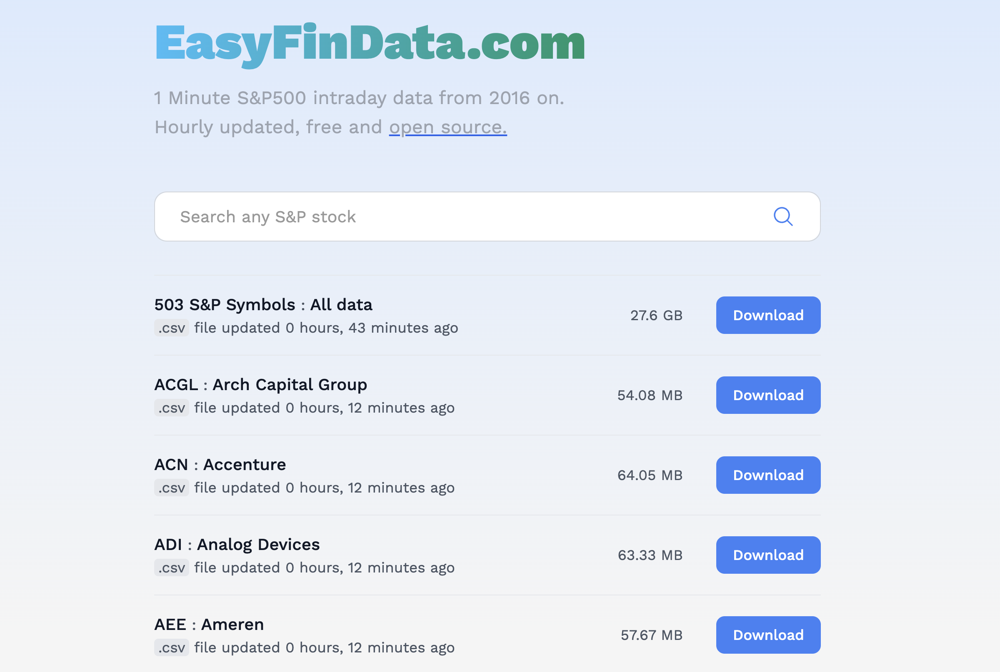

# EasyFinData: Intraday 1Min S&P500 Database Hourly Updated (2016 - Today)

**DISCLAIMER**: This project is for educational and hobbyist purposes. For production-ready products please use professional financial API data services such as [IQFeed](https://www.iqfeed.net/), [PolygonIO](https://polygon.io/), or [Alpaca Markets](https://alpaca.markets/).

## What

This website/project automatically collects and stores 1Min intraday data of the S&P500 from `2016-01-01` on in flat files - making easy to non-coders to download intraday data.

## Why

I couldn't find any easy, accesible, and free platform that provided intraday stock data files.

I figured that more people would have the same problem - e.g. see the [multiple reddit posts about intraday data](https://www.google.com/search?q=intraday+data+free+site%3Awww.reddit.com).

## How

The website it's hosted in a [Hetzner VPS](https://www.hetzner.com/cloud/) in Germany. The data comes from [Alpaca Markets API](https://alpaca.markets/), and updated every hour
using their generous API free tier (limit 200calls/min) via [Cron jobs](https://en.wikipedia.org/wiki/Cron).
