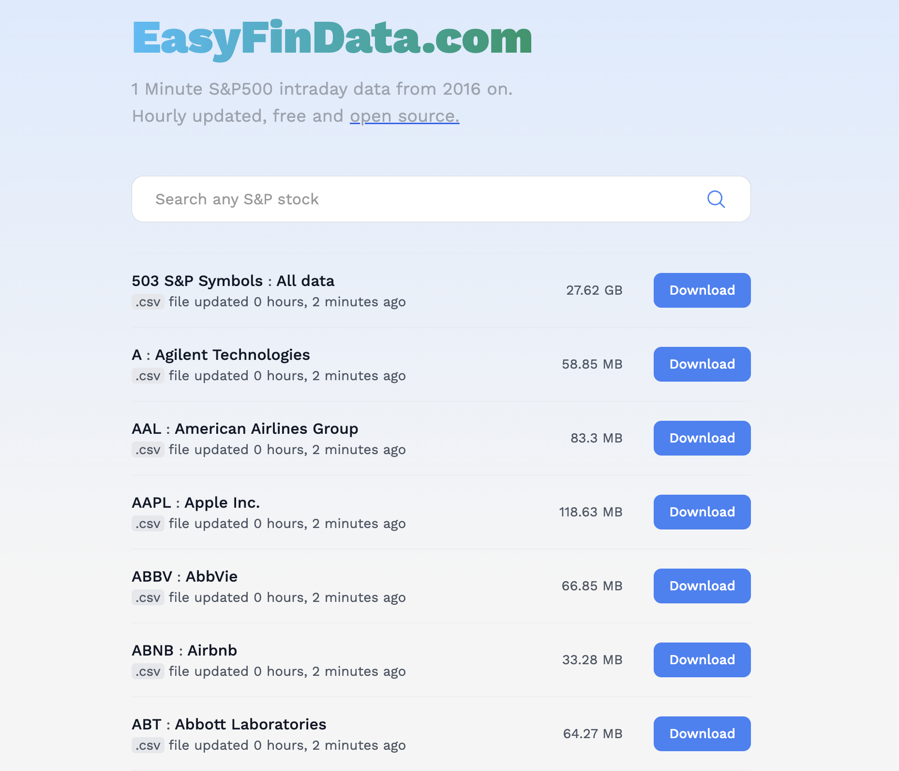

# Intraday 1Min S&P 500 Database Daily Updated (2016 - Today)

**DISCLAIMER**: This repository is for educational and hobbyist purposes. For production-ready products please use professional financial API data services such as [IQFeed](https://www.iqfeed.net/), [PolygonIO](https://polygon.io/), or [Alpaca Markets](https://alpaca.markets/).

## What >

This repository automatically collects and stores 1Min intraday data of the S&P500 from `2016-01-01` until current date.

## Why >

I couldn't find any easy, accesible, and free platform that provided intraday stock data files.

I figured that more people would have the same problem - e.g. see the [multiple reddit posts about intraday data](https://www.google.com/search?q=intraday+data+free+site%3Awww.reddit.com).

## Where >

The data it's stored in the following public Google Drive:

https://drive.google.com/drive/u/0/folders/1HBQklHrysMzYLCUc9mVjeznjriO7vu_r

## When >

The data is updated every hour from 4.00 AM to 8.30 PM (Eastern Time) for all the S&P 500 symbols.

## How >

- Data: [Alpaca Markets](https://alpaca.markets/). I'm using their generous API free tier (limit 200calls/min).
- Storage: Google Drive via [API](https://developers.google.com/drive/api/guides/about-sdk).
- Automation/cron job: [Github Actions](https://docs.github.com/en/actions)
